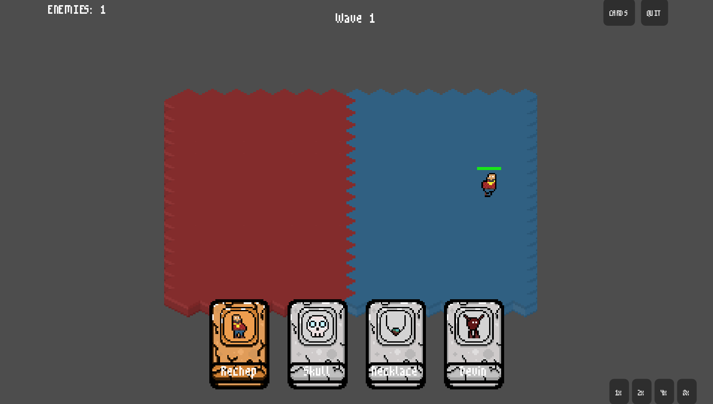

# Hold the Line

> A 2D isometric auto-battle card placement game — place your fighters, hold the line.

---

## About

**Hold the Line** is a wave-based auto-battler with a card placement twist. During the prep phase, drag character cards onto the isometric battlefield to position your army. Once the wave starts, your fighters automatically engage the incoming enemies — no clicking required.

Each wave is harder than the last. Enemies scale up, gain bonus stats, and your roster improves alongside them through per-wave buffs.

---

## How to Play

1. **Drag cards** from your hand onto the left side of the battlefield
2. When you're ready (or run out of cards), the wave begins automatically
3. Your characters fight on their own — watch the battle unfold
4. **Survive** as many waves as possible

---

## Cards

| Type | Description |
|------|-------------|
| **Warrior** | Places a fighter on the battlefield. Comes in 5 rarities: Bronze → Silver → Gold → Emerald → Diamond |
| **Passive** | Instant effect when played — heal allies, boost stats, kill an enemy, draw extra cards, and more |

---

## Built With

- [Godot 4.6](https://godotengine.org/)
- GDScript
- Pixel art (m3x6 font, custom sprites)
